[TOC]

# virtualbox install and usage

**document support**

ysys

**date**

2018-12-17

**label**

virtualbox,windows install,usage

## virtualbox install

​	当前virtualbox版本：VirtualBox-4.3.12-93733-Win.exe

​	当前windows版本：win10_x64

​	

**提示：如果在本机已经安装了virtualbox，请忽略此小结，之前在win10环境中安装virbox-5.x版本经常报错，需要选择版本较低4版本才可以在win10上使用(写于20181218）**

​	

​	按照如下图所示

​	双击软件VirtualBox-4.3.12-93733-Win.exe

​	选择NEXT按钮

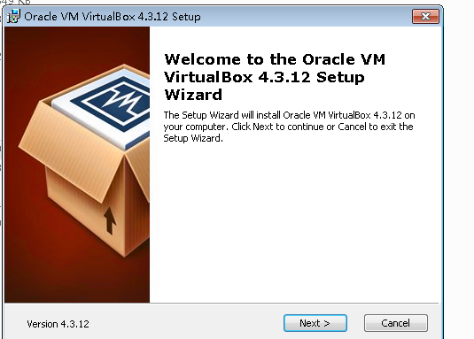

​	当前操作是选择安装部署路径，默认当前选择，选择Next按钮

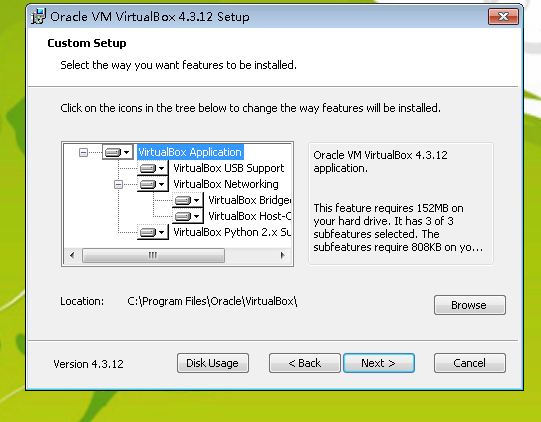

​	当前操作是否在桌面上快捷方式和创建快速启动栏，默认选择Next按钮

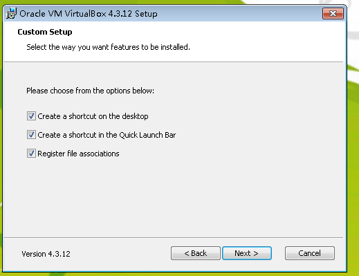

​	警告或者提示，需要安装virtualbox网卡，默认选择Yes按钮

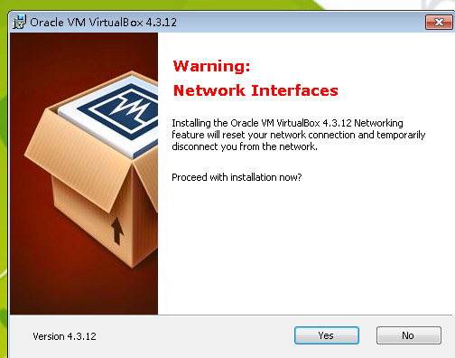

​	当前提示安装网卡，默认选择Install按钮

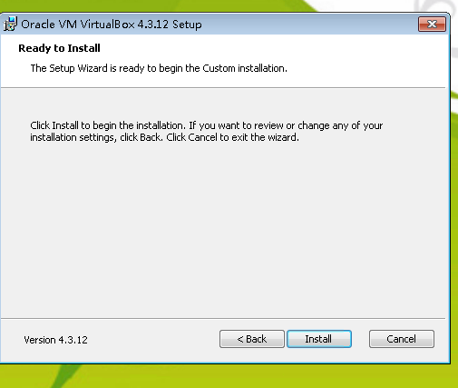

​	当前提示是否`是否安装这个软件`,选择`安装`按钮，在`始终信任`处✔

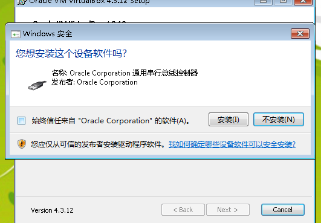

​	在当前图示下，选择`Finash`就可以了

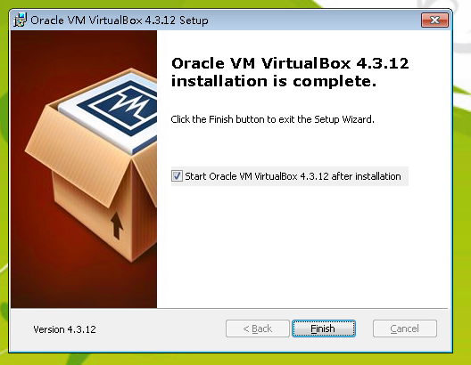

## virutualbox usage

### modify the environment

​	很多情况下，我们需要修改virtualbox整体环境

​	打开oracle vm virtualbox 管理器,在`管理`菜单栏中找到`全局设定`，主要修改工作目录,可以修改`常规`的`默认虚拟电脑位置`，主要是为了当拷贝一个虚拟机时，默认会拷贝到当前工作目录下，修改它，防止占满C盘

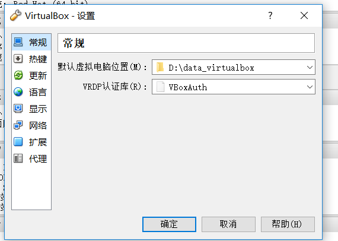

​	打开wifi栏下的`网络和internet设置`，找到`更改适配器选项`，找到一个名称叫做`VirtualBox Host-Only`的网卡，修改ip4属性,尽量改成192.168.1.1(如果使用我的虚拟环境)

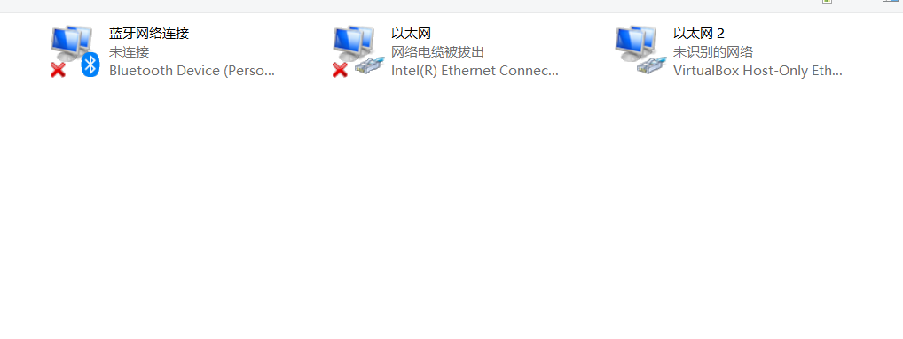

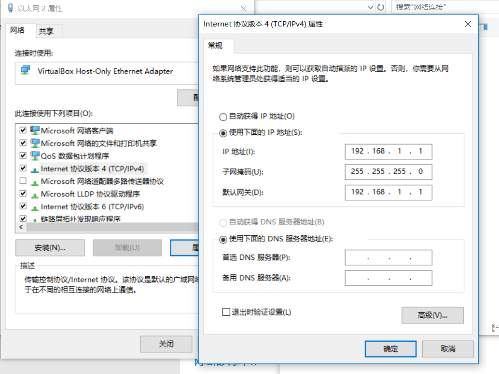

​	在过程中可能会报错，报’192.168.1.1‘已经存在，ip地址可以依次往上递增192.168.1.2,网管地址不要修改

### add older virtualbox machine

​	如果想要添加一个已经存在的虚拟机，可以参考如下操作

​	1、打开oracle vm virtualbox 管理器

​	2、在`控制`菜单栏中找到`注册`子操作后，出现选择文件路径的操作，找到之前的virtualbox machine的以`vobx`结尾的文件，选择它，就可以将之前存在的虚拟机添加成功，并且使用了

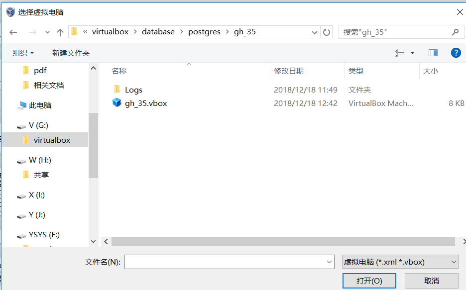

### the virutalbox machine error x64

​	默认本机电脑不会启动虚拟化的，这样如果是部署64位或者拷贝64位环境后，会报错

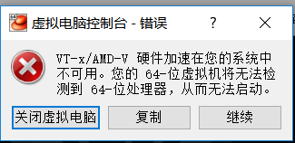

​	这个需要查询一下当前服务器进入到操作系统BIOS，开启虚拟化的操作。

