[TOC]

# was install software

**document support**

ysys

**date**

2018-12-20

**label**

was,install software


## configure data source

​	解压贵爷安装包找到sql脚本

```
select * from dba_data_files;

create tablespace TS_PORTAL_CONF
datafile
'/u01/app/oracle/oradata/orcl/ts_portal_conf.dbf' size 1G

CREATE USER DIDS
  identified by "DRAGON"
  default tablespace TS_PORTAL_CONF
  temporary tablespace TEMP
  profile DEFAULT;

GRANT connect TO DIDS;
GRANT resource TO DIDS;

GRANT select any table TO DIDS;
GRANT unlimited tablespace TO DIDS;

GRANT create any view to DIDS;
GRANT create any synonym to DIDS;

grant create any procedure to DIDS;
grant debug any procedure to DIDS;
grant debug connect session to DIDS;


```

​	后在pl/sql工具下登陆到dids用户的command window窗口下执行脚本,`@`后会弹出选择文件路径，请选择正确路径

```
SQL> @
```

​	出现三个警告是导包人员的失误,可以略过

```
===================================
Warning: Procedure created with compilation errors
Creating procedure SP_USER_EXTRACTIVE
=====================================
Warning: Procedure created with compilation errors
Creating procedure SP_USER_EXTRACTIVE_NEW
=========================================
Warning: Procedure created with compilation errors

```

之后到第三个脚本

```
SQL> @
```

出现几条数据无法插入，重新执行

```
insert into T_RIGHT_ORGRIGHT (ID, ORG_ID, APP_ID, FUN_ID)
values ('8a81815637bc1ef90137cb750add01b0', '00000000000000000000000000000001', '8a81815637bc1ef90137c4bcad4a0002', '8a81815637bc1ef90137c4c0e5cc0075');

insert into T_RIGHT_ORGRIGHT (ID, ORG_ID, APP_ID, FUN_ID)
values ('8a81815637bc1ef90137cb750add01b1', '00000000000000000000000000000001', '8a81815637bc1ef90137c4bcad4a0002', '8a81815637bc1ef90137c4c0e5cc0076');

insert into T_RIGHT_ORGRIGHT (ID, ORG_ID, APP_ID, FUN_ID)
values ('8a81815637bc1ef90137cb750add01b2', '00000000000000000000000000000001', '8a81815637bc1ef90137c4bcad4a0002', '8a81815637bc1ef90137c4c0e5cc0077');

insert into T_RIGHT_ORGRIGHT (ID, ORG_ID, APP_ID, FUN_ID)
values ('8a81815637bc1ef90137cb750add01b3', '00000000000000000000000000000001', '8a81815637bc1ef90137c4bcad4a0002', '8a81815637bc1ef90137c4c0e5db0078');

insert into T_RIGHT_ORGRIGHT (ID, ORG_ID, APP_ID, FUN_ID)
values ('8a81815637bc1ef90137cb750add01b4', '00000000000000000000000000000001', '8a81815637bc1ef90137c4bcad4a0002', '8a81815637bc1ef90137c4c0e4f10029');

```

开启was数据源配置

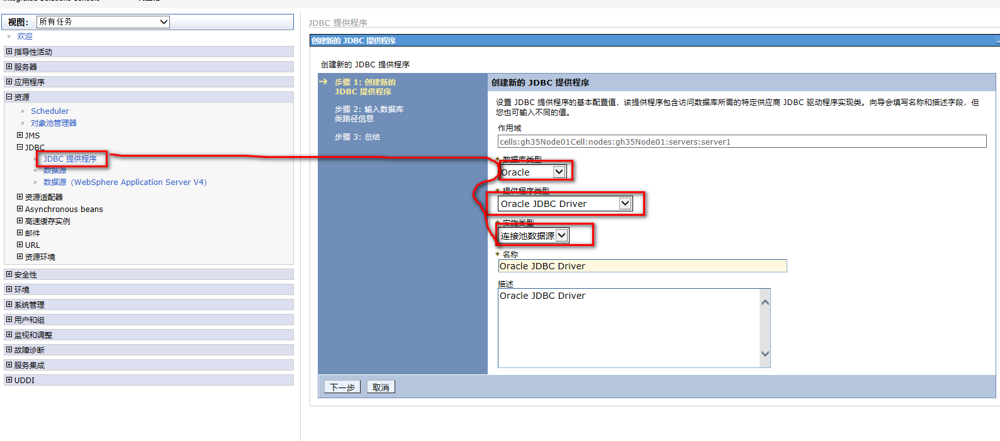

首先找到ojdbc14.jar的路径并将ojdbc14.jar拷贝到was路径下

```
# find / -name ojdbc14.jar
# cd /opt/IBM/WebSphere/AppServer/lib
# cp /u01/app/oracle/product/11.2.0/dbhome_1/owb/wf/lib/ojdbc14.jar .
# ls -ls ojdbc14.jar
1504 -rw-r--r-- 1 root root 1536554 Dec 20 13:00 ojdbc14.jar
```

填写path路径是`/opt/IBM/WebSphere/AppServer/lib`,选择下一步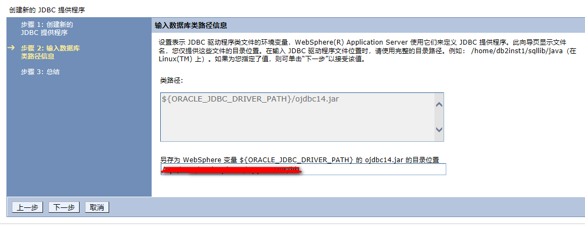

点击完成

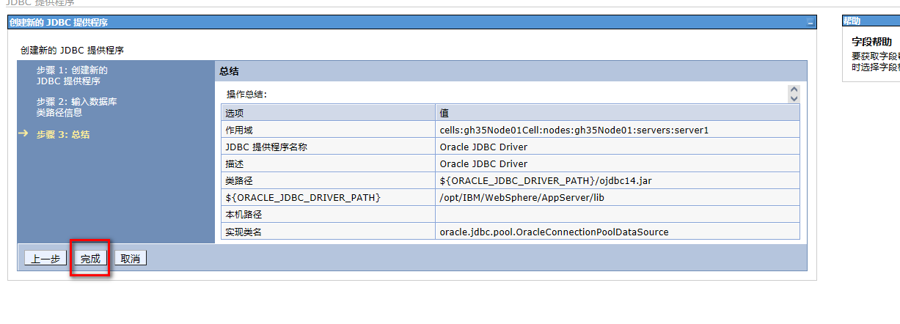

点击保存


如下图

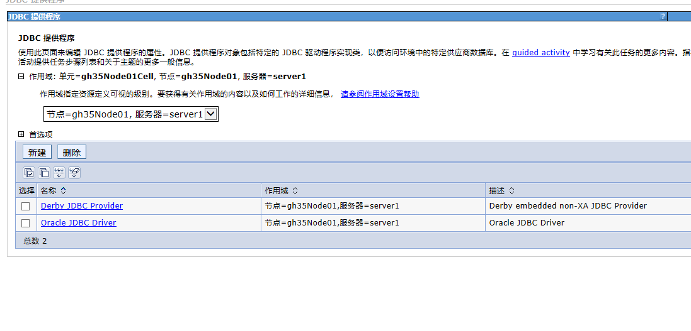

点击数据源添加

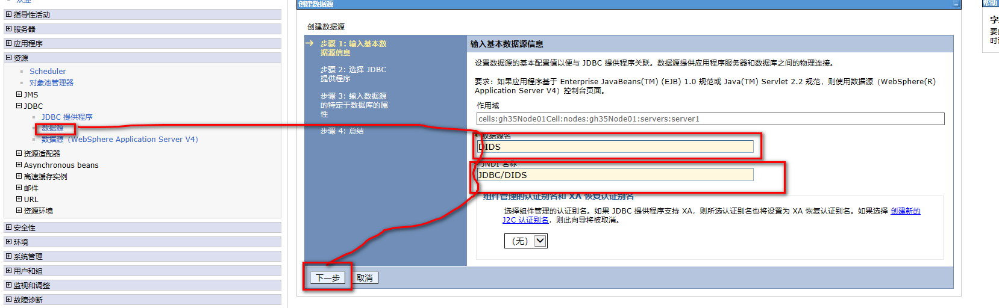


点击下一步

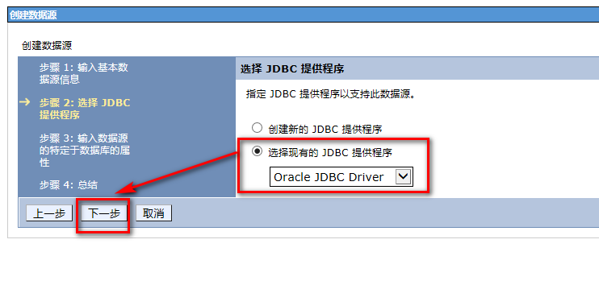

点击下一步

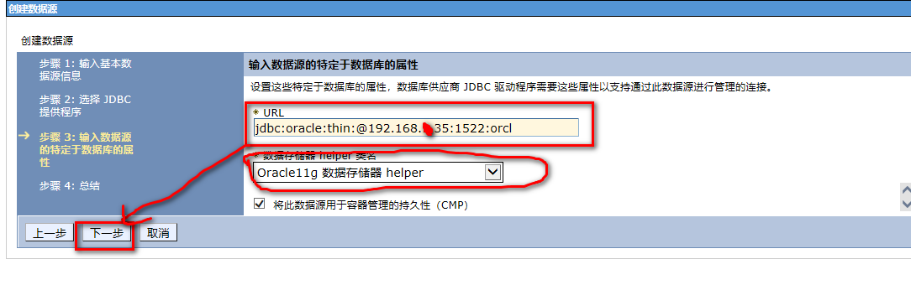

点击完成

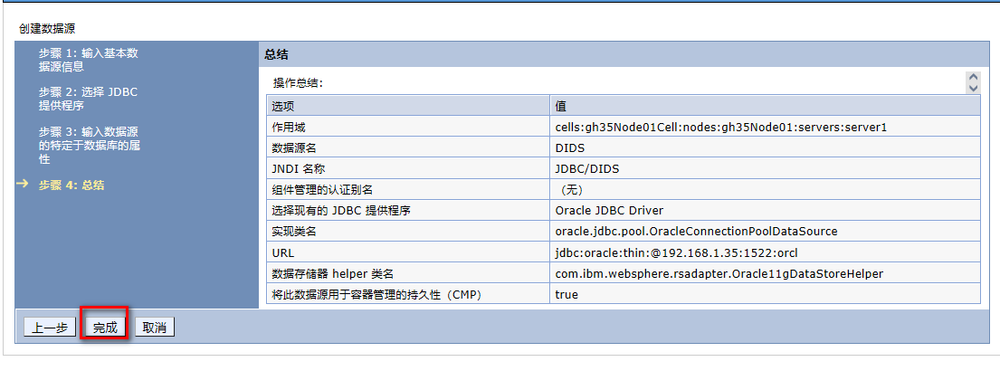

点击保存

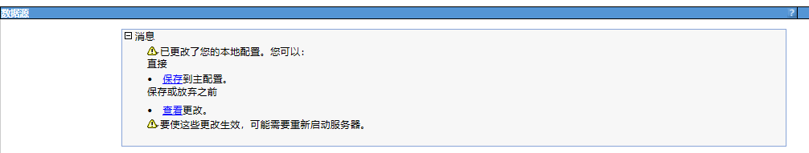


​	再次在点击数据源并点击dids

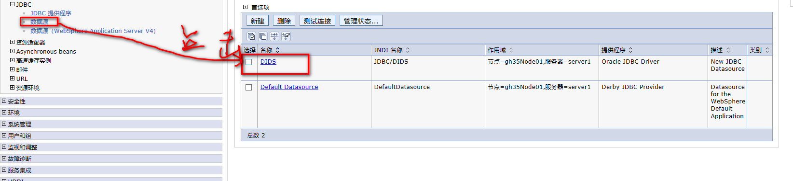

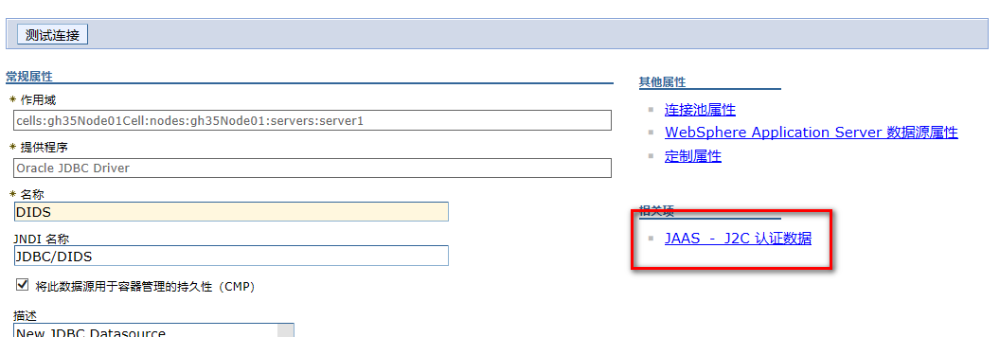


​	进入到`JAAS-J2C`认证数据中选择新建

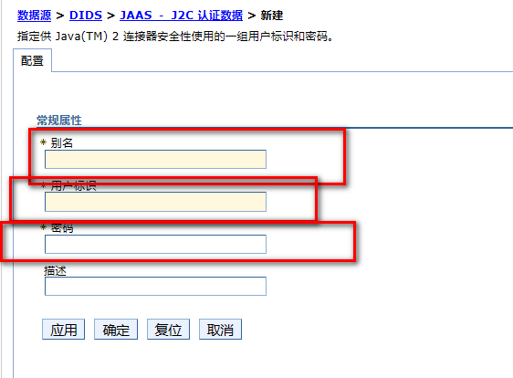

​	本次别名配置`DIDS`，用户标识`DIDS`，密码天知道

​	

​	确定后重新回退到数据源配置中,选择组建管理的认证别名，后保存，点击测试连接

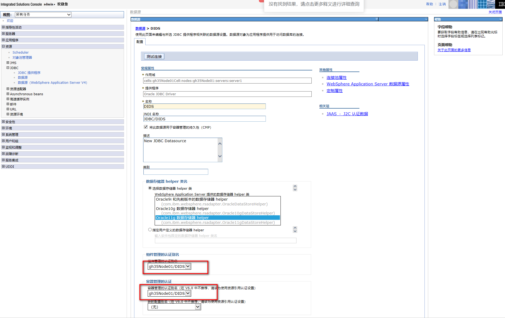

​	

在连接池属性中优化,was优化完成

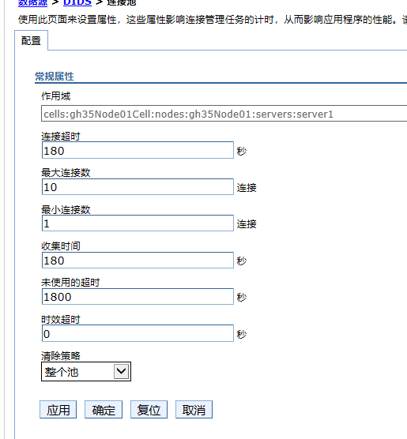


### install software

​	在`应用程序`下找到`安装新的应用程序`,在本地上传dids.war包，设置上下文根`/dids`，后点击`下一步`

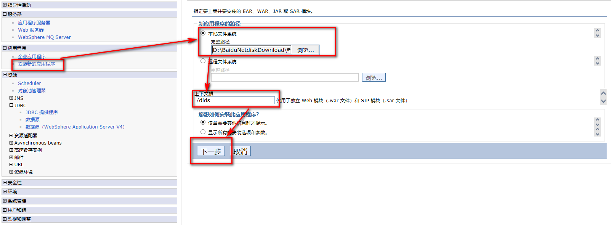

​	选择下一步

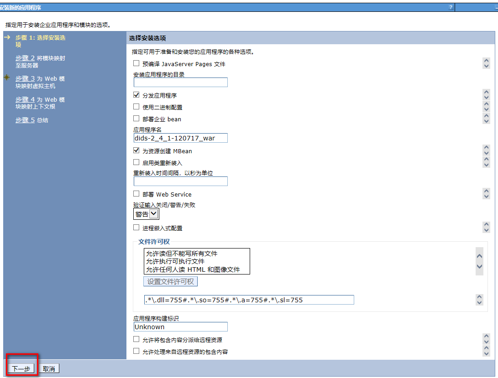

​	点击下一步

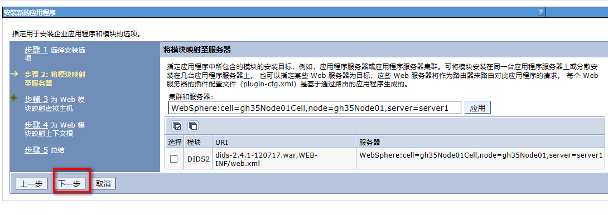

​	点击下一步

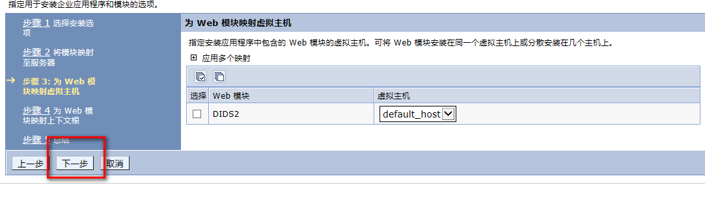

​	点击下一步

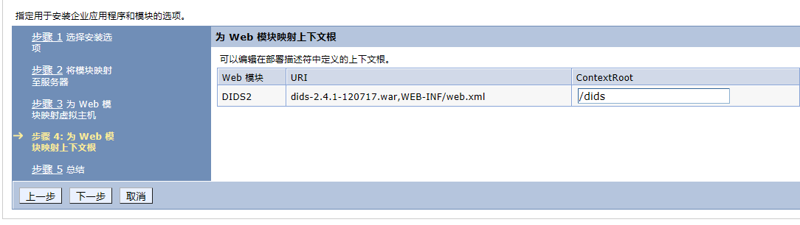

​	点击完成

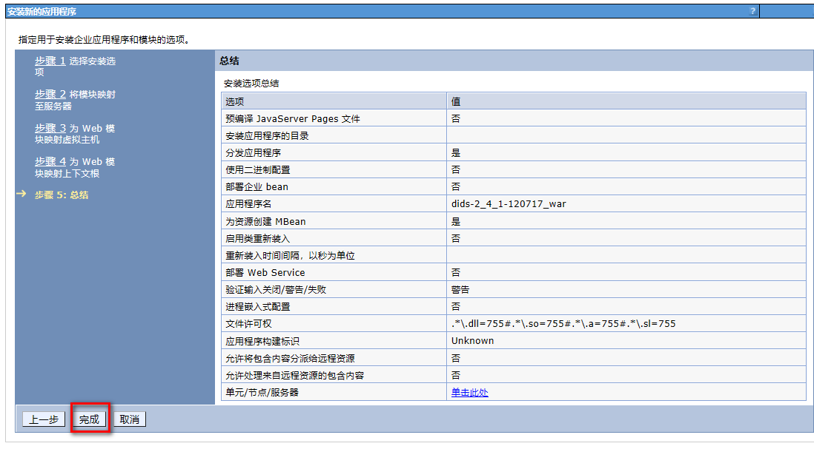

​	点击保存

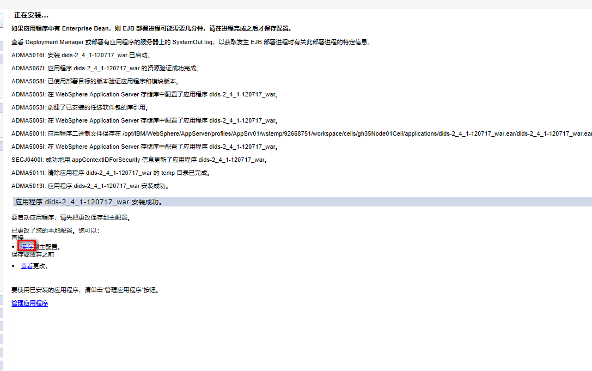


​	再次重复安装操作安装didsserver,只要修改上下文根，其他是一样的安装，不做后续截图

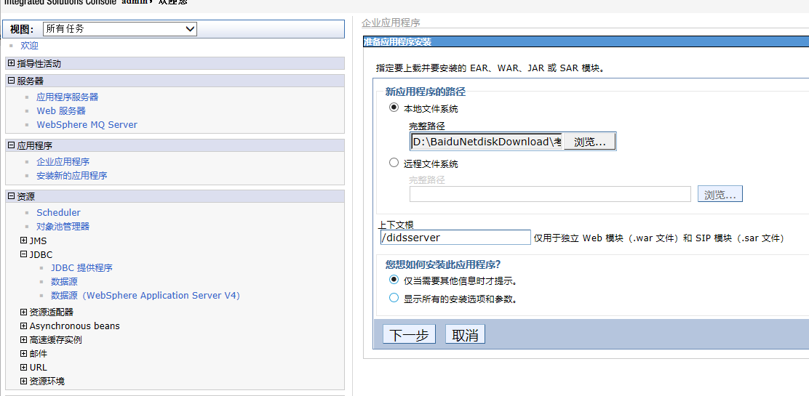

​	

​	现在添加许可证包

```
jaxen-1.1-beta-7.jar
jdom.jar
xerces-2.6.2.jar 
```

​	执行命令,找到相关路径

```
# find / -name jaxen-1.1-beta-7.jar
# find / -name jdom.jar
# find / -name xerces-2.6.2.jar 
```

​	本次安装部署路径

```
# cd /opt/IBM/WebSphere/AppServer/profiles/AppSrv01/installedApps/gh35Node01Cell/dids-2_4_1-120717_war.ear/dids-2.4.1-120717.war/WEB-INF/lib
# cp jaxen-1.1-beta-7.jar  /opt/IBM/WebSphere/AppServer/lib
# cp jdom.jar  /opt/IBM/WebSphere/AppServer/lib
# cp xerces-2.6.2.jar   /opt/IBM/WebSphere/AppServer/lib
```

 	修改dids文件

​	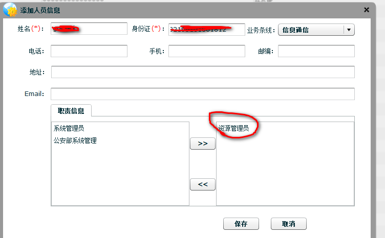

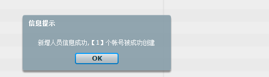

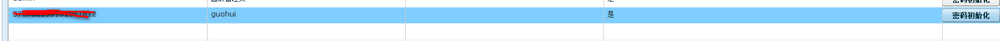