[TOC]

# redhat 7.4 install single oracle 11.2.0.4

**document support**

ysys

**date**

2018-12-10

**label**

redhat 7.4,single oracle,install


## environment

| 环境      | 版本                                   |      |
| --------- | -------------------------------------- | ---- |
| operation | redhat 7.4 x64                         |      |
| database  | p13390677_112040_Linux-x86-64_1of7.zip |      |
| database  | p13390677_112040_Linux-x86-64_2of7.zip |      |

​	目前这边的操作系统是redhat 7.4 x64;目前使用的数据库软件是p13390677_112040_Linux-x86-64_1of7.zip，p13390677_112040_Linux-x86-64_2of7.zip

​	其实今天下午就和一位用户一起部署过，在部署过程中，遇到了两个包没有找到，跳过后，中间遇到了一个报错，虽然后面安装好像是部署成功了，可是还是不放心，重新在虚拟机上部署，整理该文档。


## install failed then install again

​	一般情况下只需要删除{ORACLE_HOME}，或者将创建部署oralce的路径删除，重新创建并授权

```
# rm -rf /u01/app/oracle/product/11.2.0.4/db_1
# rm -rf /u01
```


## install

​	其实Oracle的部署或者其他软件在linux的部署很多都是需要依赖包，最好部署相关的操作系统的镜像文件。

### unpack files

```
# ls -ls
total 2487200
1362876 -rw-r--r--. 1 root root 1395582860 Dec 10 23:34 p13390677_112040_Linux-x86-64_1of7.zip
1124324 -rw-r--r--. 1 root root 1151304589 Dec 10 23:34 p13390677_112040_Linux-x86-64_2of7.zip
```

```
# unzip p13390677_112040_Linux-x86-64_1of7.zip
# unzip p13390677_112040_Linux-x86-64_2of7.zip
```

### hosts file

```
# vim /etc/hosts
ip  hostname

# cat /etc/hosts
..
192.168.1.8 gh8
```

​	查看当前操作系统的主机名

```
# cat /etc/hostname
gh8
```


### manual setup	

```
# vim /etc/sysctl.conf

fs.aio-max-nr = 1048576
fs.file-max = 6815744
kernel.shmall = 2097152
kernel.shmmax = 536870912
kernel.shmmni = 4096
kernel.sem = 250 32000 100 128
net.ipv4.ip_local_port_range = 9000 65500
net.core.rmem_default=262144
net.core.rmem_max=4194304
net.core.wmem_default=262144
net.core.wmem_max=1048586

# cat /etc/sysctl.conf

# /sbin/sysctl -p
```


```
# vim /etc/security/limits.conf

oracle              soft    nproc   2047
oracle              hard    nproc   16384
oracle              soft    nofile  4096
oracle              hard    nofile  65536
oracle              soft    stack   10240

# cat /etc/security/limits.conf
...
oracle              soft    nproc   2047
oracle              hard    nproc   16384
oracle              soft    nofile  4096
oracle              hard    nofile  65536
oracle              soft    stack   10240
...

```


```
# vim /etc/pam.d/login 
...
session    required     pam_limits.so

# cat /etc/pam.d/login 
...
session    required     pam_limits.so
```


```
# mount /dev/sr0 /media
mount: /dev/sr0 is write-protected, mounting read-only
# df -Th
Filesystem            Type      Size  Used Avail Use% Mounted on
/dev/mapper/rhel-root xfs        27G  8.0G   20G  30% /
devtmpfs              devtmpfs  482M     0  482M   0% /dev
tmpfs                 tmpfs     497M     0  497M   0% /dev/shm
tmpfs                 tmpfs     497M  7.0M  490M   2% /run
tmpfs                 tmpfs     497M     0  497M   0% /sys/fs/cgroup
/dev/sda1             xfs      1014M  160M  855M  16% /boot
tmpfs                 tmpfs     100M   12K  100M   1% /run/user/42
tmpfs                 tmpfs     100M     0  100M   0% /run/user/0
/dev/sr0              iso9660   3.8G  3.8G     0 100% /media
```


```

# vim /etc/yum.repos.d/ysys.repo
[ysys]
name= ysys install
baseurl=file:///media
enabled=1
gpgcheck=0


# yum update
Loaded plugins: langpacks, product-id, search-disabled-repos, subscription-manager
This system is not registered with an entitlement server. You can use subscription-manager to register.
ysys                                                                               | 4.1 kB  00:00:00     
(1/2): ysys/group_gz                                                               | 137 kB  00:00:00     
(2/2): ysys/primary_db                                                             | 4.0 MB  00:00:00     
No packages marked for update

# yum clean all
Loaded plugins: langpacks, product-id, search-disabled-repos, subscription-manager
This system is not registered with an entitlement server. You can use subscription-manager to register.
Cleaning repos: ysys
Cleaning up everything
Maybe you want: rm -rf /var/cache/yum, to also free up space taken by orphaned data from disabled or removed repos

```


```
# vim pkgrun.sh

yum install binutils -y    ;
yum install compat-libstdc++-33 -y   ;
yum install compat-libstdc++-33.i686 -y   ;
yum install gcc -y    ;
yum install gcc-c++ -y;
yum install glibc -y  ;
yum install glibc.i686 -y  ;
yum install glibc-devel -y ;
yum install glibc-devel.i686 -y ;
yum install ksh -y    ;
yum install libgcc -y ;
yum install libgcc.i686 -y ;
yum install libstdc++ -y   ;
yum install libstdc++.i686 -y   ;
yum install libstdc++-devel -y  ;
yum install libstdc++-devel.i686 -y  ;
yum install libaio -y ;
yum install libaio.i686 -y ;
yum install libaio-devel -y;
yum install libaio-devel.i686 -y;
yum install libXext -y;
yum install libXext.i686 -y;
yum install libXtst -y;
yum install libXtst.i686 -y;
yum install libX11 -y ;
yum install libX11.i686 -y ;
yum install libXau -y ;
yum install libXau.i686 -y ;
yum install libxcb -y ;
yum install libxcb.i686 -y ;
yum install libXi -y  ;
yum install libXi.i686 -y  ;
yum install make -y   ;
yum install sysstat -y;
yum install unixODBC -y    ;
yum install unixODBC-devel -y   ;
yum install zlib-devel -y  ;
yum install elfutils-libelf-devel -y ;


# chmod 777 pkg_run.sh 
# ./pkg_run.sh
```


```
# groupadd -g 54321 oinstall
# groupadd -g 54322 dba
# groupadd -g 54323 oper

# useradd -g oinstall -G dba,oper oracle
```


### additional setup


```
# passwd oracle
```


```
# vim /etc/selinux/config

SELINUX=permissive

# setenforce Permissive
```

```
# systemctl stop firewalld
# systemctl disable firewalld
```

```
# mkdir -p /u01/app/oracle/product/11.2.0.4/db_1
# chown -R oracle:oinstall /u01
# chmod -R 775 /u01
```


```
# su - oracle
$ vim .bash_profile
export ORACLE_SID=orcl
export ORACLE_BASE=/u01/app/oracle
export ORACLE_HOME=/u01/app/oracle/product/11.2.0/dbhome_1
export PATH=$ORACLE_HOME/bin:$PATH
export LD_LIBRARY_PATH=$ORACLE_HOME/lib:/lib:/usr/lib
export CLASSPATH=$ORACLE_HOME/JRE:$ORACLE_HOME/jlib:$ORACLE_HOME/rdbms/jlib
```


### installation


```
$ ./runInstaller
```

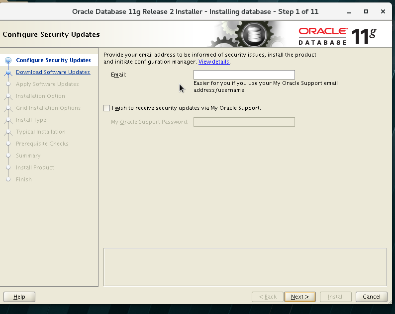

取消`I wish to receive security updates via My Oracle Support`

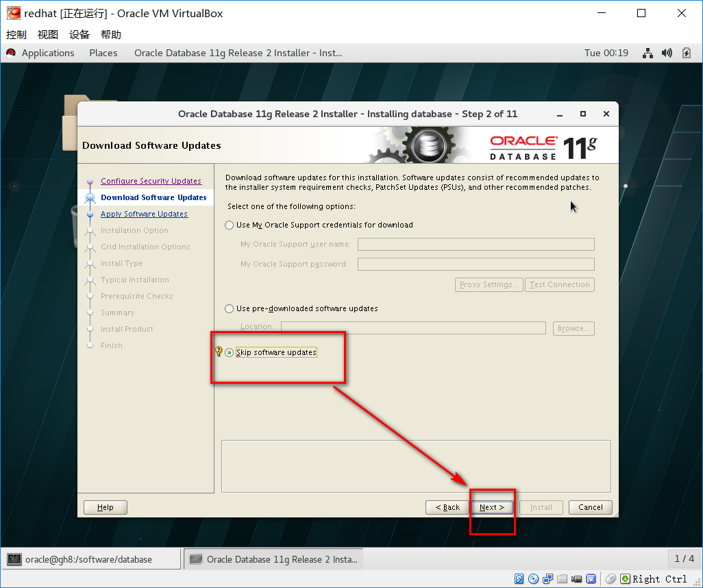

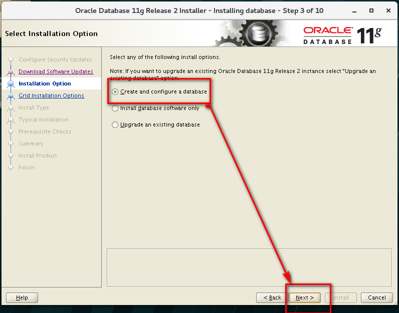

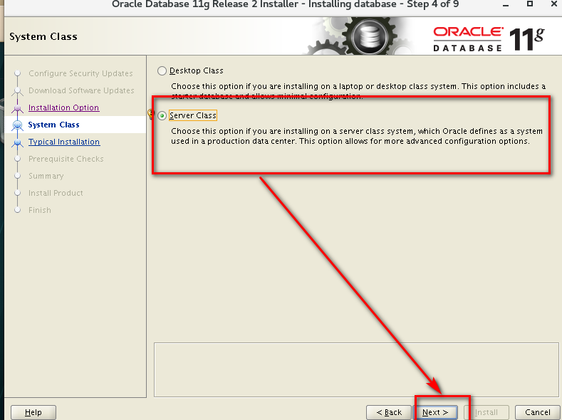

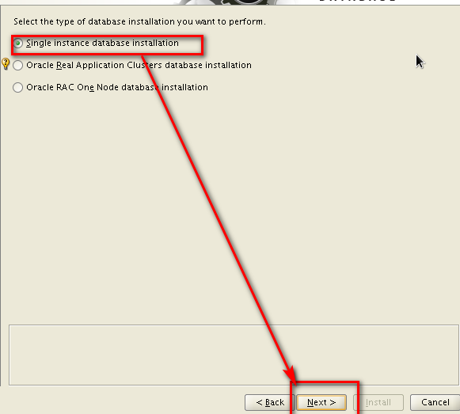


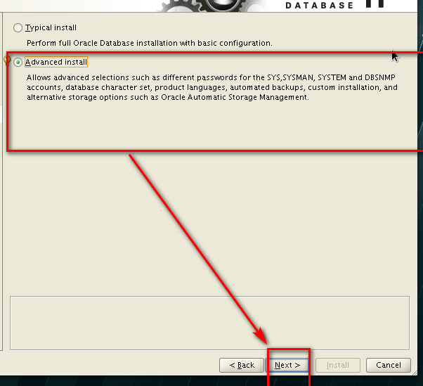


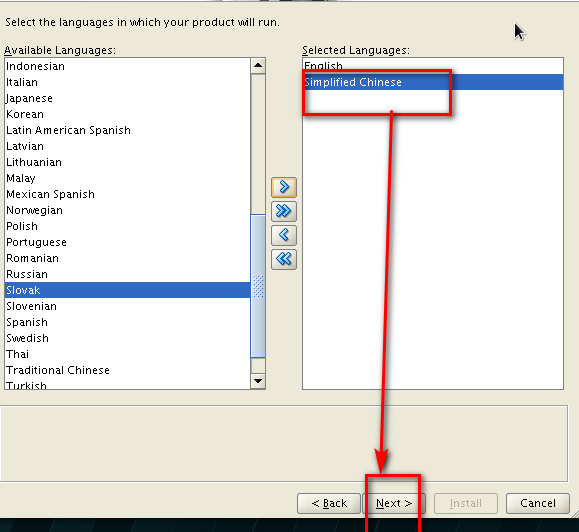


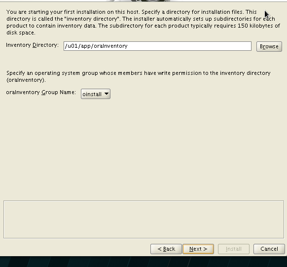


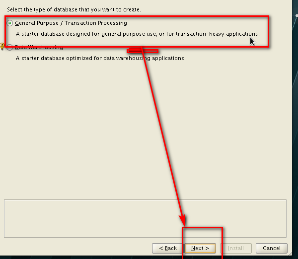


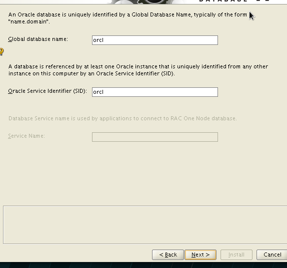


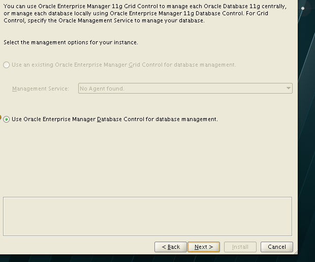


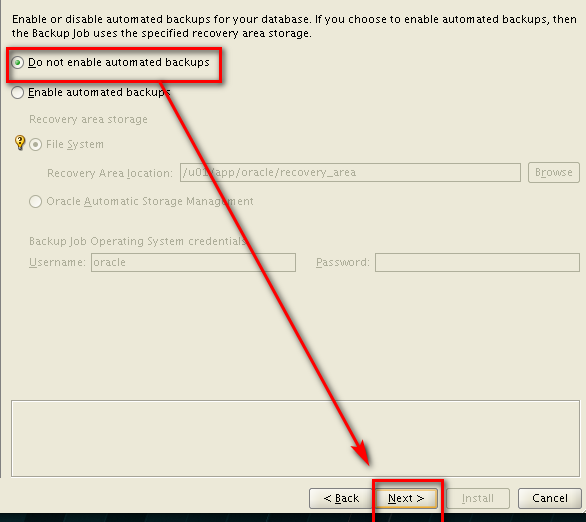


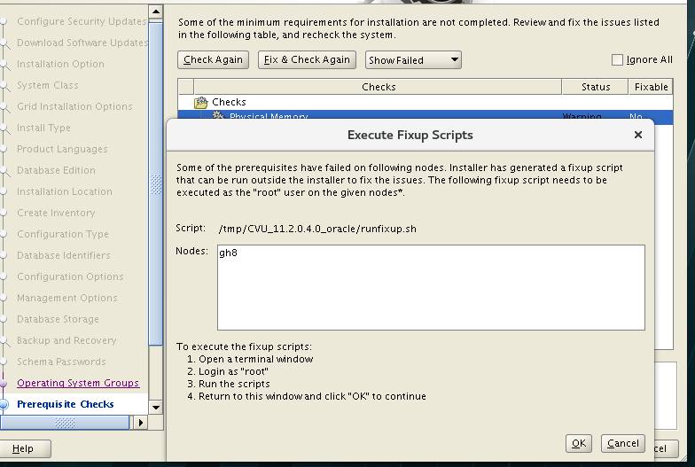

​	检查`Fix & Check Again`出现的`/tmp/CVU_11.2.0.4.0_oracle/runfixup.sh`,请注意是在root用户下执行，执行成功后点击`OK`

​	还有两个rpm没有安装


 	安装完compat**包后，另外一个pdksh可以暂时不考虑

compat-libstdc++-33-3.2.3-72.el7.x86_64.rpm下载路径

链接：https://pan.baidu.com/s/1AN4NTwAlgQB-_EBhvXwyJg 
提取码：bihy 

```
# rpm -ivh compat-libstdc++-33-3.2.3-72.el7.x86_64.rpm 
```

​	ignore all 后选择NEXT

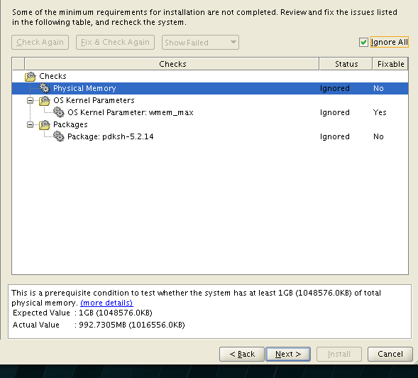

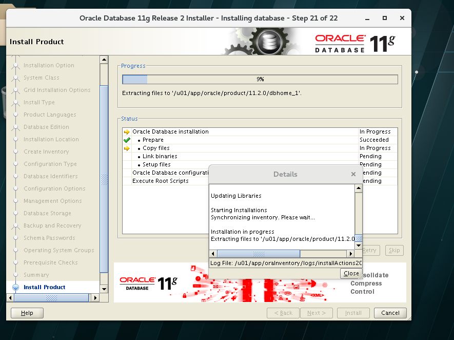


​	在安装的过程中出现报错,之前以为是没有安装依赖包报错，其实是其他的问题导致的。

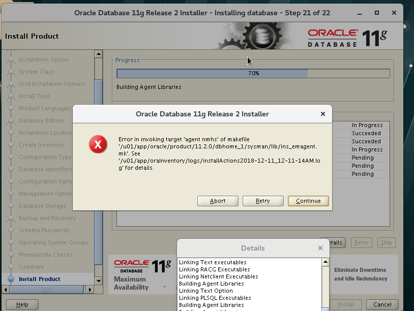

```
$ cd $ORACLE_HOME/sysman/lib
$ cp ins_emagent.mk ins_emagent.mk.bak
$ vi ins_emagent.mk
```

​	找到$(MK_EMAGENT_NMECTL) 在后面添加-lnnz11 

```
#===========================
#  emdctl
#===========================
$(SYSMANBIN)emdctl:
        $(MK_EMAGENT_NMECTL) -lnnz11 
#===========================
#  nmocat
#===========================
```


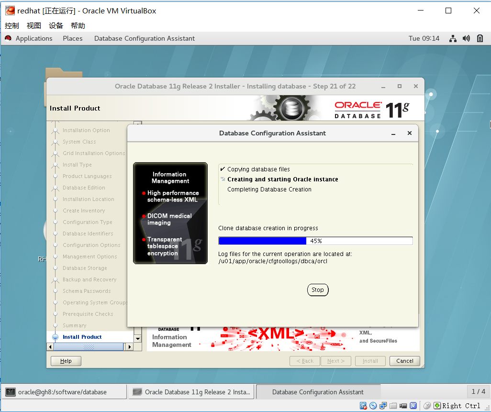

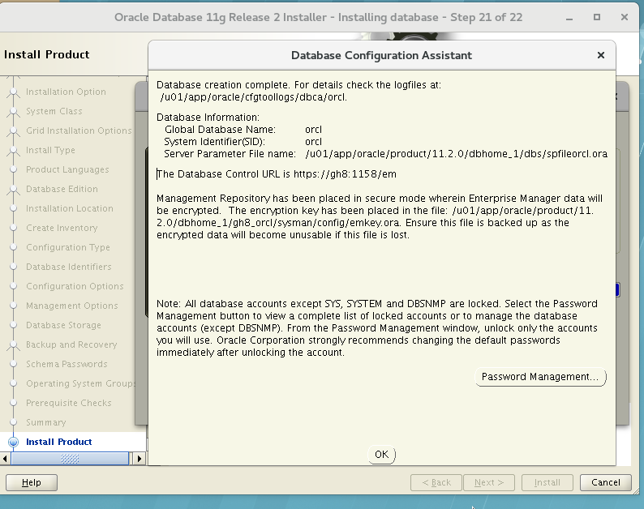

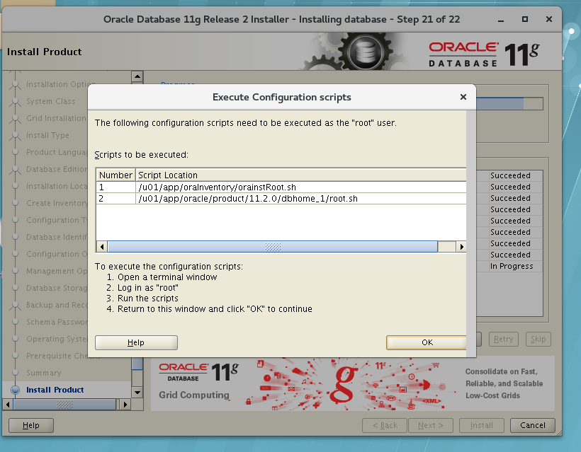

执行两个脚本，都要在root用户下执行，记得执行完成后点击OK

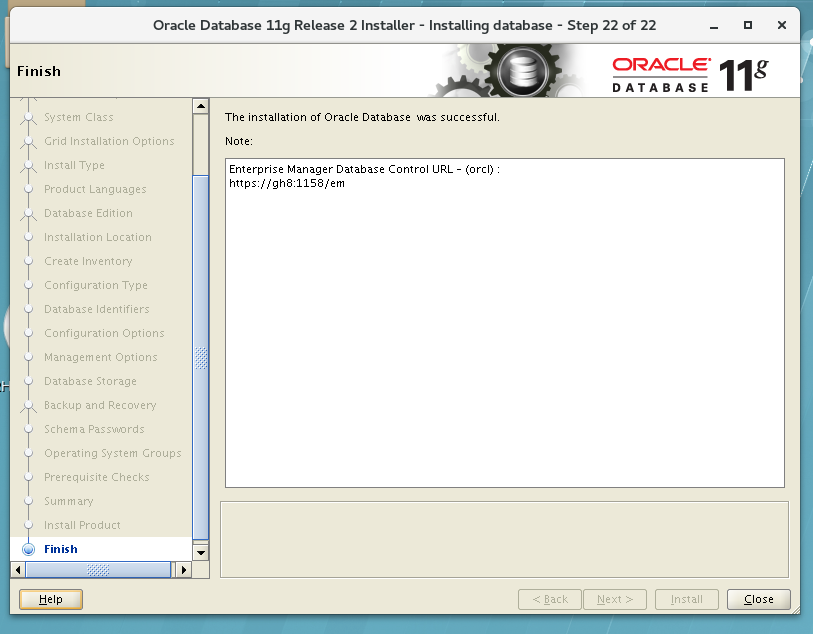

​	

## test

​	使用pl/sql连接上去，看看是否可以。


## single database starup or shutdown

### shutdown 

```
# su - oracle
$ sqlplus / as sysdba
> shutdown immediate
> exit
$ lsnrctl stop
```

### startup

```
# su - oracle
$ lsnrctl start
$ sqlplus / as sysdba
> startup
```


## 链接地址

https://oracle-base.com/articles/11g/oracle-db-11gr2-installation-on-oracle-linux-7

http://www.itkaifang.com/?id=78

https://www.linuxidc.com/Linux/2017-03/142095.htm