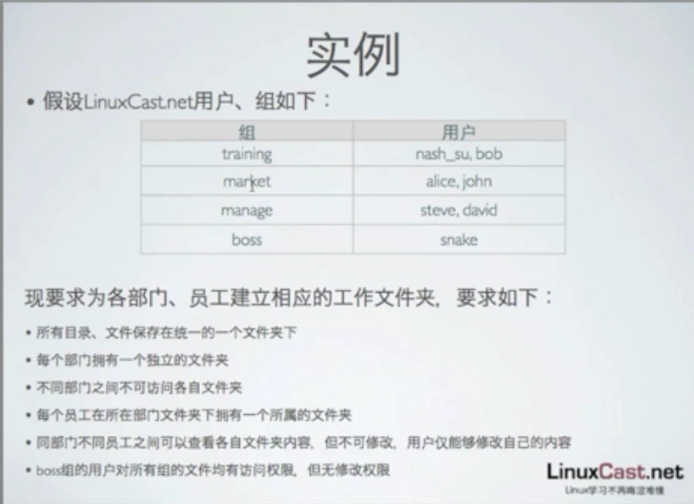

[TOC]

# linux 测试 ACL 权限

​	要求如下：




1、第一步创建组和用户，建议不要使用主族，使用附属族

```
# groupadd training
# groupadd market
# groupadd manage
# groupadd boss
# useradd -G training nash_su
# useradd -G training bob
# useradd -G market alice
# useradd -G market john
# useradd -G manage steve
# useradd -G manage david
# useradd -G boss snake
```

2、所有部门，文件保存在同一的一个文件夹下,建议在根路径下创建一个目录

```
# mkdir /fileown
# ls -ld /fileown
drwxr-xr-x 2 root root 4096 Aug 29 12:46 fileown
```

​	可以看到其他用户和组只有对该文件夹进行访问权限

3、每个部门都有自己的目录

```
# cd /fileown
# mkdir training
# mkdir market
# mkdir manage
# mkdir boss
$ ls -ls
total 16
4 drwxr-xr-x 2 root boss     4096 Aug 29 12:48 boss
4 drwxr-xr-x 2 root manage   4096 Aug 29 12:48 manage
4 drwxr-xr-x 2 root market   4096 Aug 29 12:48 market
4 drwxr-xr-x 2 root training 4096 Aug 29 12:48 training


```

4、不同部门不能访问对方的文件夹

```
# chmod o-rx boss
# chmod o-rx manage
# chmod o-rx market
# chmod o-rx training
# ls -lt
total 16
drwxr-x--- 2 root boss     4096 Aug 29 12:48 boss
drwxr-x--- 2 root manage   4096 Aug 29 12:48 manage
drwxr-x--- 2 root market   4096 Aug 29 12:48 market
drwxr-x--- 2 root training 4096 Aug 29 12:48 training
```

```
# su - nash_su
$ cd /fileown/boss
-bash: cd: /fileown/boss: Permission denied
$ cd /fileown/manage/
-bash: cd: /fileown/manage/: Permission denied
$ cd /fileown/market/
-bash: cd: /fileown/market/: Permission denied
$ cd /fileown/training/
$ ls
```

5、每个员工在所在文件下有自己的文件夹

```
# ls -lt
total 16
drwxr-x--- 2 root boss     4096 Aug 29 12:48 boss
drwxr-x--- 2 root manage   4096 Aug 29 12:48 manage
drwxr-x--- 2 root market   4096 Aug 29 12:48 market
drwxr-x--- 2 root training 4096 Aug 29 12:48 training
# cd training/
# mkdir nash_su
# mkdir bob
# cd ..
# cd market/
# mkdir alice
# mkdir john
# cd ..
# cd manage/
# mkdir steve
# mkdir david
# cd ./boss
# mkdir snake
```

```
# ls -lR
.:
total 16
drwxr-x--- 2 root boss     4096 Aug 29 12:48 boss
drwxr-x--- 4 root manage   4096 Aug 29 13:00 manage
drwxr-x--- 4 root market   4096 Aug 29 12:59 market
drwxr-x--- 4 root training 4096 Aug 29 12:59 training

./boss:
total 4
drwxr-xr-x 2 root root 4096 Aug 29 13:47 snake

./boss/snake:
total 0

./manage:
total 8
drwxr-xr-x 2 root root 4096 Aug 29 13:00 david
drwxr-xr-x 2 root root 4096 Aug 29 12:59 steve

./manage/david:
total 0

./manage/steve:
total 0

./market:
total 8
drwxr-xr-x 2 root root 4096 Aug 29 12:59 alice
drwxr-xr-x 2 root root 4096 Aug 29 12:59 john

./market/alice:
total 0

./market/john:
total 0

./training:
total 8
drwxr-xr-x 2 root root 4096 Aug 29 12:59 bob
drwxr-xr-x 2 root root 4096 Aug 29 12:59 nash_su

./training/bob:
total 0

./training/nash_su:
total 0
```

