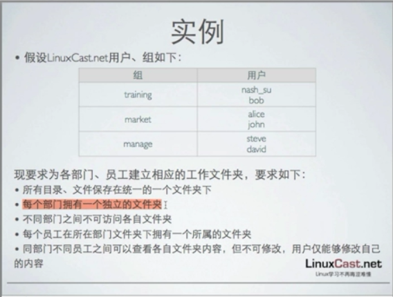

[TOC]

# 测试 linux 

​	

​	本次测试来自于一张照片上的信息



​	用户有一个主族，n个附属组(不超过31个) ，文件权限是属于用户和所属组。

```
# mkdir guoh
# ls -ls
total 106
 4 dr-xr-xr-x.   2 root root  4096 Apr 12 03:04 bin
 2 dr-xr-xr-x.   5 root root  1024 Jan 23  2018 boot
 0 drwxr-xr-x   17 root root  3560 Aug 12 00:50 dev
12 drwxr-xr-x. 116 root root 12288 Aug 12 00:55 etc
 4 drwxr-xr-x    2 root root  4096 Aug 12 01:02 guoh
 4 drwxr-xr-x.   2 root root  4096 Sep 23  2011 home
 4 dr-xr-xr-x.  11 root root  4096 Jan 23  2018 lib
12 dr-xr-xr-x.   9 root root 12288 Apr 12 03:04 lib64
16 drwx------.   2 root root 16384 Jan 23  2018 lost+found
 4 drwxr-xr-x.   2 root root  4096 Sep 23  2011 media
 0 drwxr-xr-x    2 root root     0 Aug 12 00:50 misc
 4 drwxr-xr-x.   2 root root  4096 Sep 23  2011 mnt
 0 drwxr-xr-x    2 root root     0 Aug 12 00:50 net
 4 drwxr-xr-x.   3 root root  4096 Jan 31  2018 opt
 0 dr-xr-xr-x  145 root root     0 Aug 12  2018 proc
 4 dr-xr-x---.  28 root root  4096 Aug 12 00:55 root
12 dr-xr-xr-x.   2 root root 12288 Apr 12 03:04 sbin
 4 drwxr-xr-x.   2 root root  4096 Jan 23  2018 selinux
 4 drwxr-xr-x.   2 root root  4096 Sep 23  2011 srv
 0 drwxr-xr-x   13 root root     0 Aug 12  2018 sys
 4 drwxrwxrwt.  12 root root  4096 Aug 12 00:51 tmp
 4 drwxr-xr-x.  13 root root  4096 Jan 23  2018 usr
 4 drwxr-xr-x.  22 root root  4096 Jan 23  2018 var
# chmod o-rx guoh
# ls -ls
total 106
 4 dr-xr-xr-x.   2 root root  4096 Apr 12 03:04 bin
 2 dr-xr-xr-x.   5 root root  1024 Jan 23  2018 boot
 0 drwxr-xr-x   17 root root  3560 Aug 12 00:50 dev
12 drwxr-xr-x. 116 root root 12288 Aug 12 00:55 etc
 4 drwxr-x---    2 root root  4096 Aug 12 01:02 guoh
 4 drwxr-xr-x.   2 root root  4096 Sep 23  2011 home
 4 dr-xr-xr-x.  11 root root  4096 Jan 23  2018 lib
12 dr-xr-xr-x.   9 root root 12288 Apr 12 03:04 lib64
16 drwx------.   2 root root 16384 Jan 23  2018 lost+found
 4 drwxr-xr-x.   2 root root  4096 Sep 23  2011 media
 0 drwxr-xr-x    2 root root     0 Aug 12 00:50 misc
 4 drwxr-xr-x.   2 root root  4096 Sep 23  2011 mnt
 0 drwxr-xr-x    2 root root     0 Aug 12 00:50 net
 4 drwxr-xr-x.   3 root root  4096 Jan 31  2018 opt
 0 dr-xr-xr-x  145 root root     0 Aug 12  2018 proc
 4 dr-xr-x---.  28 root root  4096 Aug 12 00:55 root
12 dr-xr-xr-x.   2 root root 12288 Apr 12 03:04 sbin
 4 drwxr-xr-x.   2 root root  4096 Jan 23  2018 selinux
 4 drwxr-xr-x.   2 root root  4096 Sep 23  2011 srv
 0 drwxr-xr-x   13 root root     0 Aug 12  2018 sys
 4 drwxrwxrwt.  12 root root  4096 Aug 12 00:51 tmp
 4 drwxr-xr-x.  13 root root  4096 Jan 23  2018 usr
 4 drwxr-xr-x.  22 root root  4096 Jan 23  2018 var

```

```
# groupadd training
# groupadd market
# groupadd manager
# useradd -g training nash_su
# useradd -g training bob
# useradd -g market alice
# useradd -g market john
# useradd -g manager steve
# useradd -g manager david
```


```
[root@centos65 guoh]# mkdir training
[root@centos65 guoh]# mkdir market
[root@centos65 guoh]# mkdir manager
[root@centos65 guoh]# chgrp training training
[root@centos65 guoh]# chgrp market market
[root@centos65 guoh]# chgrp manager manager
[root@centos65 guoh]# ls -lt
total 12
drwxr-xr-x 2 root manager  4096 Aug 12 04:57 manager
drwxr-xr-x 2 root market   4096 Aug 12 04:57 market
drwxr-xr-x 2 root training 4096 Aug 12 04:57 training
[root@centos65 guoh]# cd training/
[root@centos65 training]# mkdir nash_su
[root@centos65 training]# mkdir bob
[root@centos65 training]# ls -ls
total 8
4 drwxr-xr-x 2 root root 4096 Aug 12 05:01 bob
4 drwxr-xr-x 2 root root 4096 Aug 12 05:01 nash_su
[]
[root@centos65 guoh]# chgrp -R training training
[root@centos65 guoh]# cd training/
[root@centos65 training]# chown -R bob bob


```


​	

